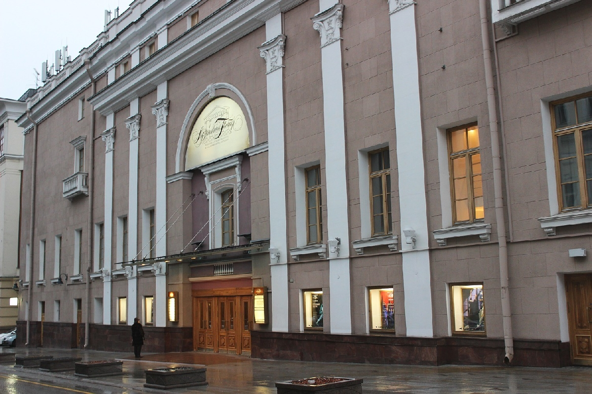

# Карта "Покажи Москву"
Пешеходный маршрут по главным улицам центра Москвы для тех, кто хочет увидеть наиболее известные достопримечательности города и параллельно заняться покупками. 
На карте отмечены основные места для посещения (с их наименованиями), а также банкоматы, кофейни и рестораны, торговые центры и места для живописных снимков.
Протяженность маршрута  - 5 км (1,5 часа).
## Подробное описание маршрута
* Начало маршрута - Сретенский монастырь.

* Пройдите вниз по ул. Большая Лубянка 250м.
* Пройдите по Варсонофьевскому пер., поверните направо и поднимитесь до Звонарского пер., поверните налево и идите прямо до ул. Петровка, затем поверните направо и идите прямо до Петровского пер., поверните налево и пройдите 150 метров.
{:height="36px" width="36px"} 
* Спуститесь вниз по ул. Большая Дмитровка 250 метров, поверните направо и пройдите через Тверскую площадь.
* Спуститесь вниз по ул. Тверская 150 метров и зайдите во двор дома номер 6.
* Выйдите обратно на ул. Тверская, спуститесь вниз 100 метров, поверните налево на Камергерский пер. и пройдите 100 метров.
* Пройдите 300 метров дальше по Камергерскому пер. и ул. Кузнецкий Мост до ул. Петровка, поверните направо и спуститесь вниз 200 метров.
* Стоя лицом к Большому театру посмотрите направо - это ЦУМ
* Стоя лицом к ЦУМу и Большому театру, поверните направо, поднимитесь вверх по Театральному проезду 300 метров до ТЦ Наутилус, затем снова поверните направо на улицу Никольская и идите прямо 400 метров.
* Продолжайте движение по Никольской улице и вы выйдите на Красную площадь.
## Использование карты для обучения РКИ

